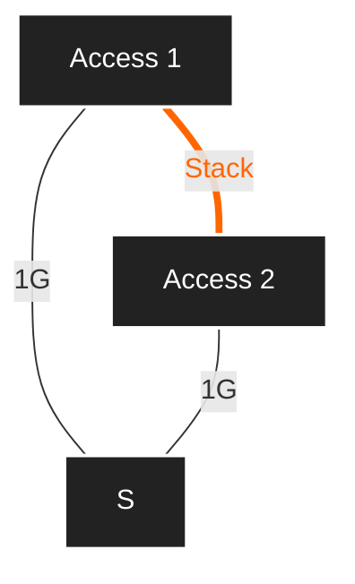
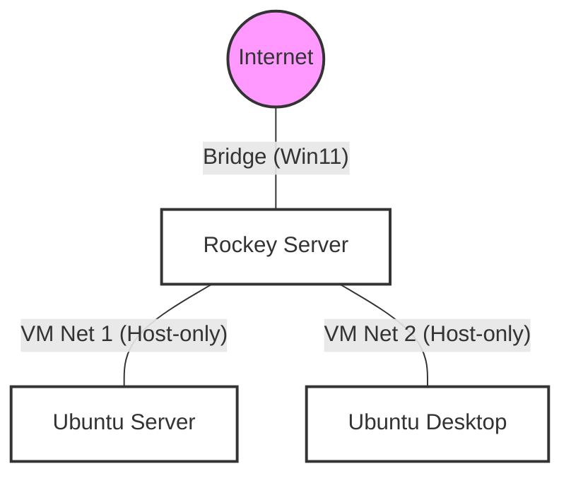
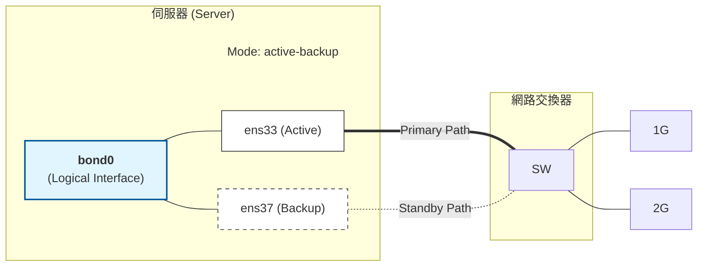

## Lab2: 
### Structure

### Network bonding (Active-Backup)

Network Bonding (NIC Teaming)
Aggregating multiple physical network interfaces (e.g., `ens33` and `ens37`) into a single logical interface (e.g., bond0) to provide redundancy and High Availability (HA).
Active-Backup Mode (Mode 1)
Failover mechanism: Only one slave interface (the "Active" one) is active at any given time.
Standby: The second interface (the "Backup" one) remains idle and only takes over if the primary active interface fails.
Single MAC Address: The logical bond interface typically uses only one MAC address (from the active NIC) to avoid confusing the network switch.
Switch-Independent (LACP X)
No LACP Required: Since the mode is Active-Backup, it does not require the physical switch (SW) to support Link Aggregation Control Protocol (LACP/802.3ad).
Simplicity: This setup is easier to deploy because it works with any standard switch without complex port-channel configurations.
Physical vs. Logical Setup
Slaves: `ens33` and `ens37` are referred to as "slave" interfaces.
Master: The bond interface acts as the "master," which is where the IP address is actually assigned.
### Component
1. Ubuntu Desktop:
   + file: ubuntu-24.04.4-desktop-amd64-autoinstall.iso
   + 172.27.X.101/24 
3. Ubuntu Server:
   + file: ubuntu-24.04.4-live-server-amd64-autoinstall.iso 
   + 172.17.X.11/24
5. Rocky Server:
   + file: Rocky-9.7-x86_64-minimal-kickstart.iso
   + 172.17.X.254/24
   + 172.27.X.254/24
   + WAN IP 140.129.26.X/24
