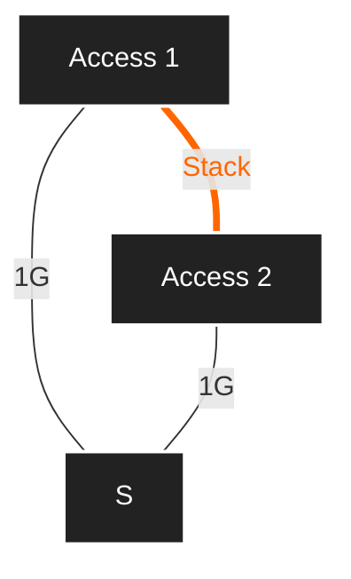
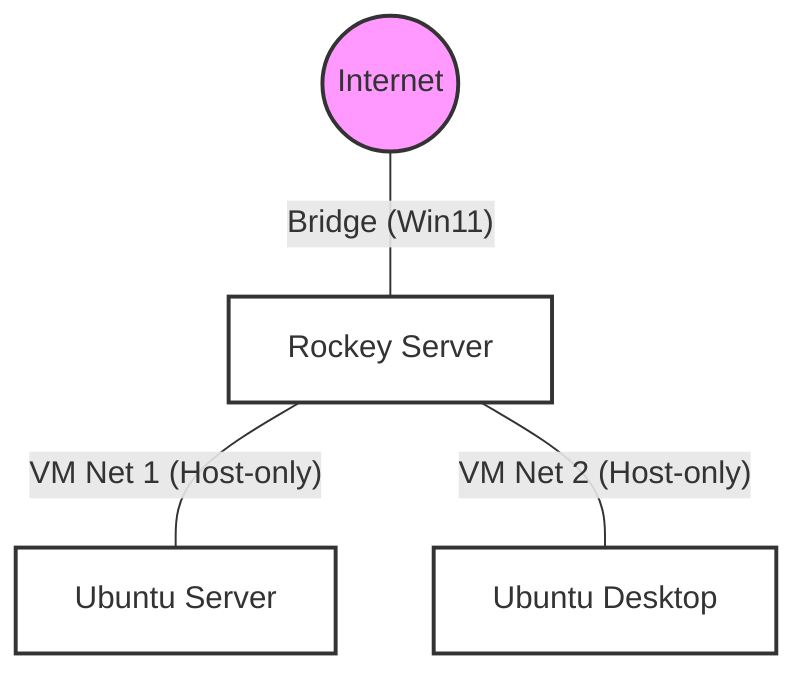

## Lab2: 
### Structure

### Component
1. Ubuntu Desktop: 172.27.X.101/24
2. Ubuntu Server: 172.17.X.11/24
3. Rocky Server: 172.17.X.254/24
                 172.27.X.254/24
                 WAN IP 140.129.26.X/24
